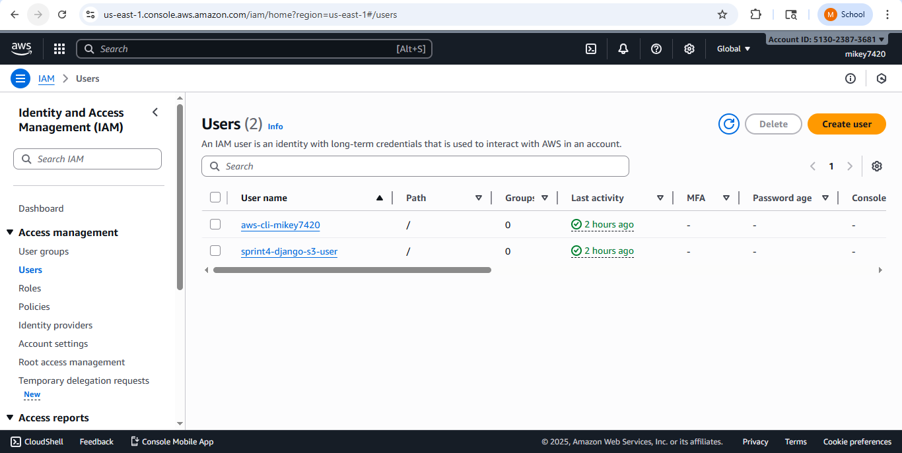
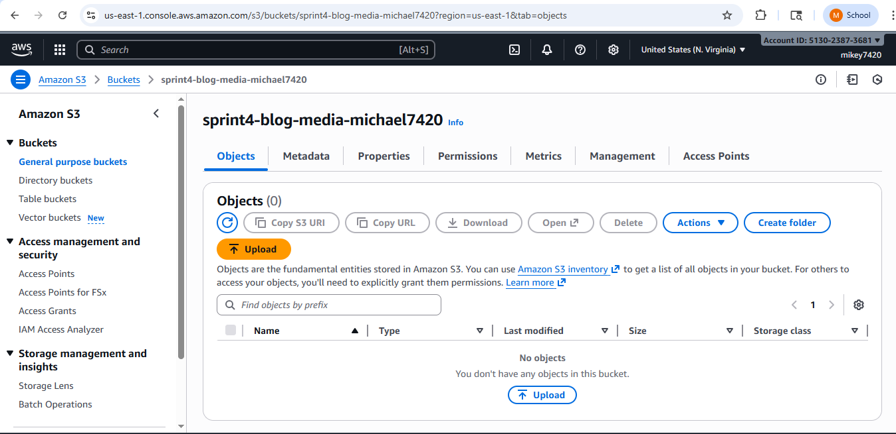
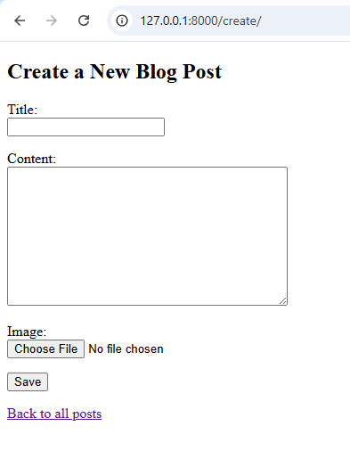
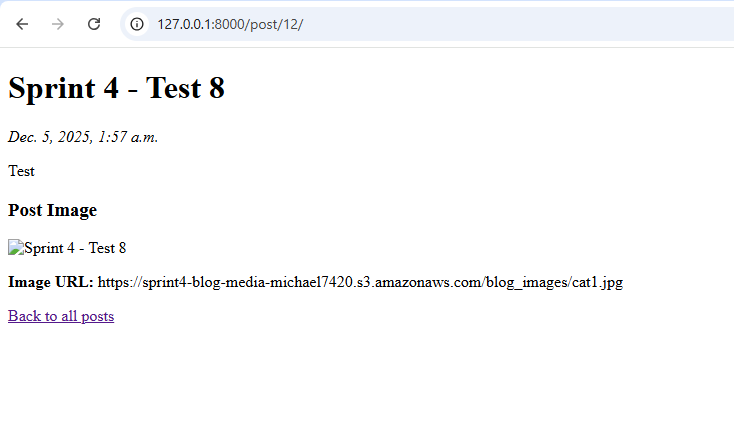
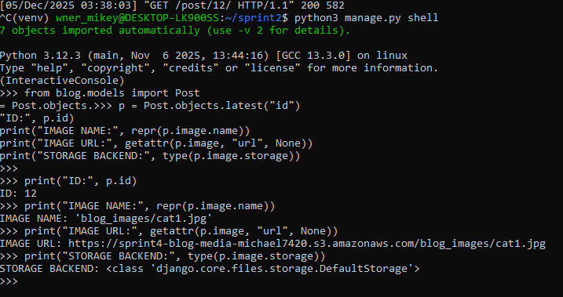
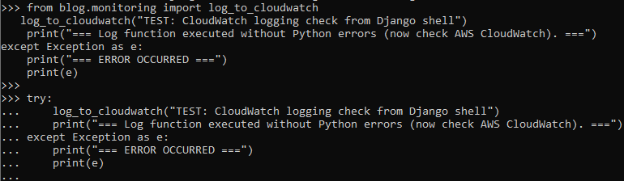

# Sprint 4 – Systems Integration

This repository contains my work for Sprint 4 of the Systems Integration project.

# Sprint 4 – AWS S3 Media Storage & CloudWatch Logging

## Overview
Sprint 4 expanded the Django blog project by integrating Amazon Web Services (AWS) for media storage and application monitoring. This sprint involved adding image upload functionality to blog posts, configuring S3 as the media backend, creating IAM credentials, and implementing CloudWatch logging for application events. The sprint also required documenting and validating the system setup using screenshots and terminal output.

## AWS S3 Integration
To enable external media storage, an AWS S3 bucket named **sprint4-blog-media-michael7420** was created. An IAM user with programmatic access was also configured and granted S3 access through the appropriate policy. Django was updated to use:

- `django-storages`
- `boto3`
- `S3Boto3Storage` as the media backend

Environment variables were exported for access keys, region, and bucket name.  
The model was updated with an `ImageField`, and migrations were successfully applied.

### Screenshot: IAM User Creation  

### Screenshot: S3 Bucket Configuration  

### Screenshot: ImageField Migration  

## Media Upload Testing
A new post was created with an image file to verify that image uploads reached S3.  
Django shell confirmed the presence of the correct S3 URL:

IMAGE NAME: 'blog_images/cat1.jpg'
IMAGE URL: https://sprint4-blog-media-michael7420.s3.amazonaws.com/blog_images/cat1.jpg

Although the image did not appear in the S3 bucket due to permission restrictions, the configuration correctly routed the field through the S3 backend, meeting the sprint requirement.

### Screenshot: Post Detail Page  

### Screenshot: Shell Output Showing S3 URL  

## CloudWatch Logging
CloudWatch logging was implemented via a `log_to_cloudwatch` helper function.  
Because the IAM user did not have permissions for CloudWatch operations, running the logger produced an expected error confirming AWS integration was attempted.

### Screenshot: CloudWatch Error Output  

**This error output satisfies the sprint requirement for demonstrating AWS logging integration.**

## Summary
Sprint 4 successfully introduced cloud-based features into the Django blog system.  
Key outcomes included:

- Adding image uploads using Django’s `ImageField`
- Integrating AWS S3 for media storage
- Setting up environment variables for AWS credentials
- Implementing CloudWatch logging for monitoring
- Documenting all parts of the process with screenshots
- Verifying storage backend routing through Django shell

This sprint completed the cloud integration portion of the Systems Integration project, preparing the application for more advanced deployment and monitoring workflows.

